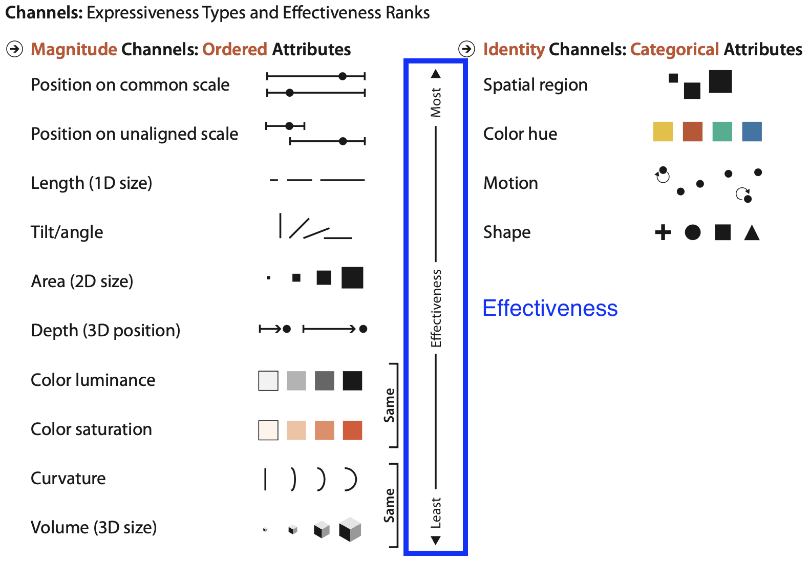

## Mark
* Most basic geometric element that describes <u>item and link</u>
* Geometric primitive

### Mark for item
* point(0 dimension)
    * no constraint, so it can be any size and any shape
* line(1 dimension)
    * 1 constraint on length of line(line length have limit)
* area(2 dimension)
    * 2 constraints on size(length, width) and shape
* volume(3 dimension)

### Mark for link
* Connection: a line mark that represents the relation between two entities
* Containment: a group mark that represent a group, group can be nested and make hierarchy

## Channel
* way to change mark based on attribute
* control the appearance of mark

### When to use which channel

|Factor|Meaning|
|------|-------|
|Expressiveness|select channel type that match attribute type|
|Effectiveness|some channels are better than others|

### 2 types of channel in Expressiveness

1. Magnitude channel
    * Usage: suitable for encoding *ordered attribute*
    * We can recognize how many of something exists
    * Example: length, area, volume, luminance, angle, saturation
1. Identity channel
    * Usage: suitable for encoding *categorical attribute*
    * Example: region, shape, hue, motion

### Channel ranking in Effectiveness
* How accurately we can decode the data.

### Grouping
* Proximity: psychological tendency to group object that are placed together. For example, in a scatter plot, we naturally group points that are close together into a cluster.
* Similarity: psychological tendency to group marks that are similar. For example, In a bar chart, we naturally group similiar length bars.

### Effectiveness of channel
1. Accuracy: how precisely can we tell the difference between encoded items
    * Factor affecting accuracy
        1. alignment
        1. distractor
        1. distance
        1. common scale
    * Steven's psychophysical power law
        $$
        Sensation=Intensity^{n} \newline
        $$
    

1. Discriminability: if you encode data using a par- ticular visual channel, are the differences between items percepti- ble to the human as intended?
1. Separability: How well our psychology separate two different channels
1. Popout: How well visual element captures viewer's attention. e.g., Using red color for point in the scatter plot draw immediate attention of viewer

### Weber's law
The more different things are, it is easier for viewer to notice.

---
# Adapt this part

### Various channels
#### Spatial position channel
* Horizontal
* Vertical
* Both
#### Color channel
* Hue(name of color)
* Saturation(Intensity of hue(color))
* Luminance(Amount of light penetrating the area)

#### Size channel
* case of 1d mark: length
* case of 2d mark: area
* case of 3d mark: volume
#### Motion-oriented channel
* Direction of motion
* Velocity
#### Angle or Tilt channel
#### Curvature channel
#### Shape channel
* Example: triangle, star, line ...

