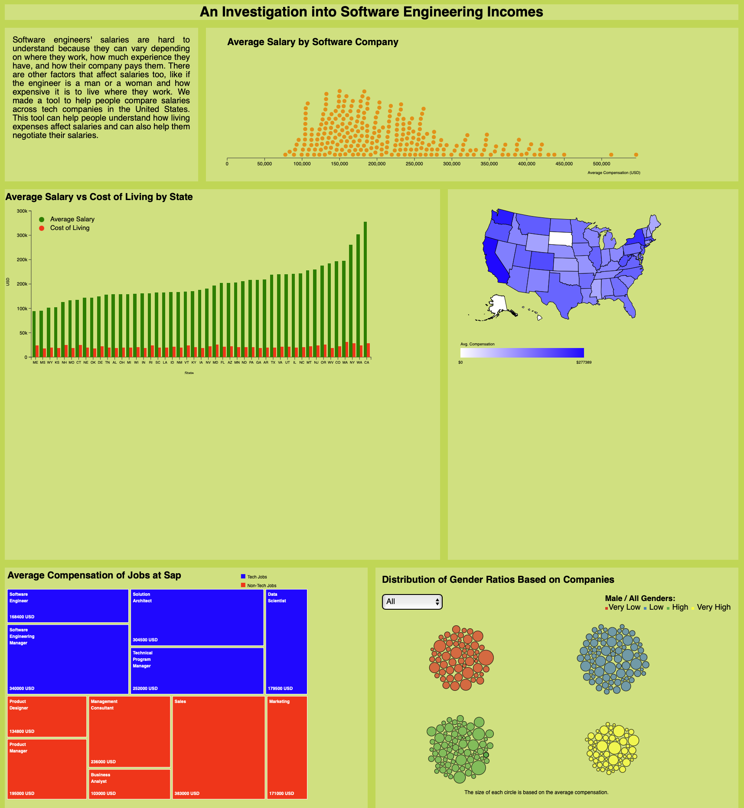

# An Introduction into Software Engineering Incomes

#### Citations

- USA-states json taken from [here](https://gist.github.com/michellechandra/0b2ce4923dc9b5809922#file-us-states-json)
- Circle packing template taken from [here](https://d3-graph-gallery.com/graph/circularpacking_template.html)
- Grouped circle packing template taken from [here](https://d3-graph-gallery.com/graph/circularpacking_group.html)
- toTitleCase function from [here](https://stackoverflow.com/questions/32589197/how-can-i-capitalize-the-first-letter-of-each-word-in-a-string-using-javascript)
- linear gradient legend in usa-map from [here](https://github.com/UBC-InfoVis/447-materials/blob/23Sep/d3-examples/d3-choropleth-map/js/choroplethMap.js)
- the dodge function in beeswarm from [here](https://observablehq.com/@d3/beeswarm/2)